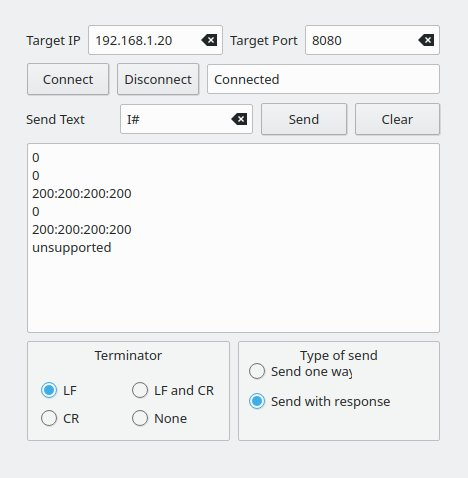

# tcp_tools

Tools are created to interact with different servers which respond on tcp level

## The tcp_terminal is the QT5 version:

For examples:

https://github.com/gdimitriu/robotics/tree/main/poc_tests/esp32/SimpleEchoWiFiServer

https://github.com/gdimitriu/waiterHomeRobot/tree/main/pocs/esp32_cam_commands

## Robot controll

This is first not fully functional of the robot controll center but with following functionality:

- commands to fetch/deploy moving value

- commands to only move the robot (using also current power setting)

- streaming from http (web based like ESP32-CAM)

- navignation is working only to interract with display (no save/load or send to robot the navigation paths)

The current version is moved to [robot controll center](https://github.com/gdimitriu/swarm_robots/robot_controll_center)
